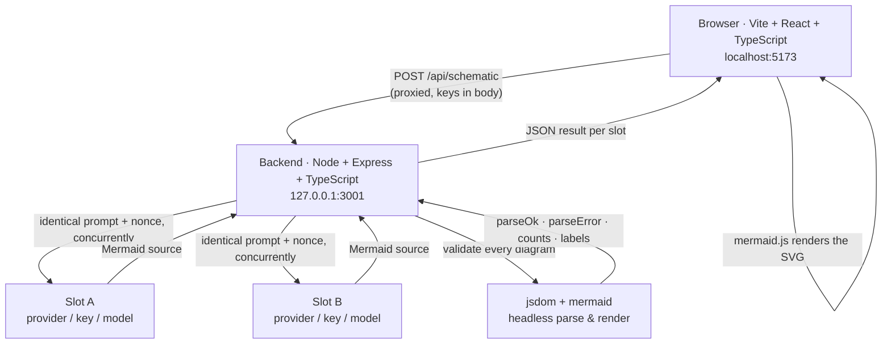
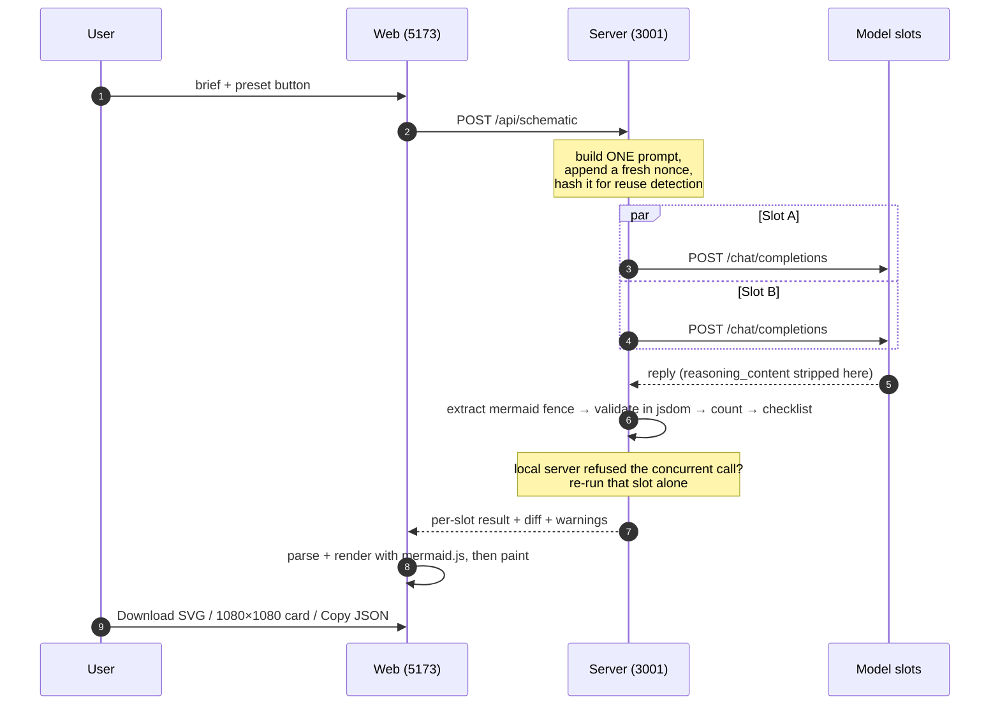

# Schematic

**Two models. One identical prompt. One Mermaid flowchart each. The checklist is the payload.**

Send `Design the architecture for X. Output ONE Mermaid flowchart...` to two model slots, render both
diagrams live with mermaid.js, and then ask the question that actually matters:

> Did this model remember a cache, a queue, auth, retries, observability, idempotency?

The result is two plausible-looking architecture diagrams where one is missing retries and
observability — and a checklist that proves it, tick by tick, with the matched label printed next to
every tick.

It is built to be screen-recorded: big readable type, a `PARSED` / `FAILED` badge per panel, verbatim
parser errors, a shareable one-line diff, and a 1080×1080 PNG share card.

---

## Table of contents

- [Quick start](#quick-start)
- [Run it entirely locally (no key at all)](#run-it-entirely-locally-no-key-at-all)
- [Why the checklist can be trusted](#why-the-checklist-can-be-trusted)
- [Architecture](#architecture)
- [How it works, in code](#how-it-works-in-code)
- [Tech stack](#tech-stack)
- [API reference](#api-reference)
- [Providers and capability rules](#providers-and-capability-rules)
- [Testing](#testing)
- [Fork and contribute](#fork-and-contribute)
- [Non-goals](#non-goals)

---

## Quick start

```bash
npm install
npm run dev
```

- Frontend: <http://localhost:5173>
- Backend:  <http://127.0.0.1:3001>

Paste an API key into a slot's **Configure** panel and press **Design both**. No `.env` file, no key in
the repo, nothing to sign up for if you already run Ollama or LM Studio.

### Run it entirely locally (no key at all)

1. Start LM Studio (or Ollama) and load a model.
2. Set both slots' provider to **LM Studio** or **Ollama**.
3. Press **Design both**.

The model picker populates from the provider's own `GET /v1/models`. You can always type a model name
by hand instead — nothing is gated on that list succeeding.

---

## Why the checklist can be trusted

Every tick is backed by evidence, and the evidence is on screen:

| Claim | How it is proven |
| --- | --- |
| The diagram is real | Rendered from the model's own Mermaid source by mermaid.js, in the browser **and** headlessly on the server |
| The diagram parses | Mermaid's real parser runs server-side; failures are shown **verbatim**, with the offending line |
| Node/edge counts are real | Read from Mermaid's parsed diagram database (`db.vertices` / `db.edges`), never counted from the raw string |
| A tick is real | The concept matched a **parsed node or edge label**, and that literal label plus its **source line number** is displayed beside the tick |
| Reasoning tokens are real | Read from `usage.completion_tokens_details.reasoning_tokens`; absent means **"n/a"**, never `0` |
| The comparison is fair | Both slots receive the byte-identical prompt, and every run appends a fresh nonce |
| Nothing is fabricated | No diagram means `sha256: null`, not the hash of the empty string; no counts means `"unavailable"`, not a guess |

### The twelve concepts

`Cache` · `Queue` · `Load balancer` · `Auth` · `Retry` · `Idempotency` ·
`Observability / metrics` · `Rate limit` · `Database` · `Circuit breaker` · `Dead-letter` · `CDN`

Matching is case-insensitive keyword matching over parsed labels, and each hit reports the regex term
that fired plus where it matched (`node`, `edge`, or — only when a diagram failed to parse — `source`).
A concept that is missing renders as a **hollow red circle** labelled *not mentioned*.

---

## Architecture



Three rules fall out of that shape:

1. **All model calls go through the backend.** That is what makes local providers work with no CORS
   setup, and it keeps API keys out of the browser's network tab.
2. **Both slots are called concurrently with a byte-identical prompt.** Only the model differs, so any
   difference in the output is the model's doing.
3. **Diagrams are validated on the server and rendered in the browser.** The server's verdict is the
   one that counts (`parseOk`), so a failure cannot be hidden by a client-side quirk.

### One run, end to end



### Project layout

```
schematic/
├── server/                      Node + Express + TypeScript (port 3001)
│   ├── src/
│   │   ├── index.ts             routes, JSON 404 + error middleware
│   │   ├── run.ts               the run: concurrency, nonce, diff, warnings
│   │   ├── modelCall.ts         fetch to /chat/completions, retries, CoT stripping
│   │   ├── extract.ts           pull Mermaid out of a reply, record which path was used
│   │   ├── validate.ts          headless parse AND render, real error text, counts
│   │   ├── dom.ts               jsdom bridge + SVG stubs + the Mermaid lock
│   │   ├── checklist.ts         the 12 concepts, matched labels, source lines
│   │   ├── providers.ts         the 5 presets (no keys, ever)
│   │   └── types.ts             the wire contract
│   └── test/                    56 tests + a mock OpenAI-compatible provider
├── web/                         Vite + React + TypeScript (port 5173)
│   └── src/
│       ├── App.tsx              state machine, run guard, exports
│       ├── components/          SlotConfigPanel · DiagramPanel · ChecklistPanel · DiffStrip
│       └── lib/
│           ├── mermaidClient.ts browser parse + render (htmlLabels: false)
│           ├── shareCard.ts     1080×1080 PNG via canvas
│           ├── panel.ts         per-panel state
│           └── config.ts        localStorage persistence, typed fetch helpers
├── verify/
│   ├── e2e.mjs                  live end-to-end checks → verify/evidence/*.json
│   ├── ui-probe.mjs             drives the real UI in headless Chrome over CDP
│   ├── probe-reliability.mts    which local models actually emit valid Mermaid
│   └── fixtures/                a real broken model reply, kept as a fixture
├── docs/BLOG.md                 the long write-up of how it was built
├── VERIFICATION.md              every acceptance criterion + raw evidence
└── README.md
```

---

## How it works, in code

### 1. Extraction records how it succeeded

Never repair a broken diagram — show the real error. But do record *how* the source was found, because
a `bare-inline` extraction is a much weaker signal than a clean fenced block.

```ts
// server/src/extract.ts
export type ExtractionPath = 'mermaid-fence' | 'plain-fence' | 'bare' | 'bare-inline' | 'none';

export function extractMermaid(reply: string): { source: string | null; path: ExtractionPath; note: string | null } {
  // 1. a ```mermaid fence  2. any fence opening with a diagram keyword
  // 3. the whole reply, if it starts with a keyword
  // 4. a keyword line found mid-reply (weaker — and we say so)
  // …
}
```

### 2. Headless Mermaid needs a DOM, and a lock

Mermaid is a browser library. To get its real parser and real renderer on the server, it needs a DOM,
two sets of stubs, and one important ordering constraint.

```ts
// server/src/dom.ts
const dom = new JSDOM('<!DOCTYPE html><html><body></body></html>', { pretendToBeVisual: true });

// Mermaid reaches for CSSStyleSheet, DOMParser, MutationObserver … by bare name.
for (const key of Object.getOwnPropertyNames(dom.window)) {
  if (SKIP.has(key)) continue;
  define(globalThis, key, (dom.window as never)[key]);
}
define(globalThis, 'navigator', dom.window.navigator); // getter-only in modern Node

// jsdom has no layout engine, so dagre's getBBox() would throw. We verify syntax
// and render success, not pixel geometry.
svgProto.getBBox = () => ({ x: 0, y: 0, width: 120, height: 24 });

// The import MUST come after the globals exist: dompurify captures `window` at
// module-evaluation time.
const mermaid = (await import('mermaid')).default;
```

```ts
// Mermaid keeps process-wide diagram state and renders through a shared temp node,
// so concurrent renders in one jsdom are not safe. Model calls stay concurrent;
// validation is serialised (it is cheap next to a model call).
export function withMermaidLock<T>(fn: () => Promise<T>): Promise<T> {
  const run = chain.then(fn, fn);
  chain = run.then(() => undefined, () => undefined);
  return run;
}
```

### 3. Two stages: parse, then actually render

A parse pass alone is not proof a diagram draws. Both stages run against real Mermaid, and a diagram is
only ok when both pass.

```ts
// server/src/validate.ts
const diagram = await mermaidAPI.getDiagramFromText(source); // real jison parser + populated DB
graph = readGraph(diagram?.db);

// Stage 2: actually render. Do not claim success without rendering.
const out = await mermaid.render(renderId, source);
```

### 4. Counts come from the parsed diagram, never the string

`FlowDB` exposes `vertices` as a **`Map`** and `edges` as an **`Array`**, and `getVertices()` returns a
stale `{}`. Reading the fields directly is what makes the counts honest — a one-line `A --> B` reports
**2 nodes / 1 edge**, where a line counter would say 1/0.

```ts
// server/src/validate.ts
const nodes = normalizeCollection(vertices).map((v) => ({
  id: str(v.id),
  label: str(v.text ?? v.label ?? v.id),   // node label lives in `text`
}));

const edges = normalizeCollection(rawEdges).map((e) => ({
  start: str(e.start ?? e.from),
  end: str(e.end ?? e.to),
  label: str(e.text ?? e.label ?? ''),     // edge label lives in `text`
}));
```

When no accessor matches a diagram type, the result is `{ source: 'unavailable', note }` — never a
number derived from the raw string.

### 5. Every tick cites the label *and* the source line

Mermaid **rewrites label text as it parses**: `<br/>` in the source comes back as `<br>`. So a parsed
label is not always a byte-for-byte substring of the source, and a naive `source.includes(label)` audit
fails even when nothing is wrong. The label is reported exactly as Mermaid read it, and the source line
is located under the same normalisation:

```ts
// server/src/checklist.ts
function normalizeForSearch(text: string): string {
  return text.replace(/<br\s*\/?>/gi, '<br>').replace(/&nbsp;/gi, ' ').replace(/\s+/g, ' ').trim();
}

export function findSourceLine(source: string, label: string): { line: number; text: string } | null {
  const target = normalizeForSearch(label);
  const lines = source.split('\n');
  for (let i = 0; i < lines.length; i++) {
    if (normalizeForSearch(lines[i]).includes(target)) return { line: i + 1, text: lines[i].trim() };
  }
  return null;
}
```

That is what makes a tick auditable rather than merely asserted:

```
Cache     = "⚡ Redis Cache Cluster"        (node label, source line 10)
Queue     = "📨 Apache Kafka\n(Event Bus)"  (node label, source line 40)
```

### 6. Capability detection, never assumptions

```ts
// server/src/modelCall.ts — absent means null, which the UI prints as "n/a".
// Never 0, and never an invented number.
const reasoningTokens = num(usage.completion_tokens_details?.reasoning_tokens);
return { reasoningTokens, reasoningSupported: reasoningTokens !== null };
```

```ts
// server/src/modelCall.ts — chain-of-thought is read only to measure it, then dropped.
const cot = message.reasoning_content ?? message.reasoning;
const reasoningCharsStripped = typeof cot === 'string' ? cot.length : 0;
return { content, reasoningCharsStripped };   // the text itself never leaves this function
```

```ts
// server/src/modelCall.ts — only Particle.ai + a deepseek-* model understands this field.
// Every other provider either ignores unknown fields or rejects them, so we omit it.
if (shouldSendThinkingFlag(config.provider, config.model, config.disableReasoning)) {
  body.chat_template_kwargs = { enable_thinking: false };
}
```

### 7. Concurrency recovery for single-instance local servers

LM Studio serves **one request at a time** and answers a second simultaneous request with an instant
HTTP 500 (sometimes 400). Since both slots must run concurrently, that would break local comparisons
roughly half the time. The detector keys off the *pattern*, not a single status code:

```ts
// server/src/run.ts
export function isLocalConcurrencyRefusal(result: ModelResult): boolean {
  if (result.errorKind !== 'http') return false;
  const status = result.attempts[0]?.httpStatus ?? null;
  if (status === null || status < 400 || status >= 600) return false;
  return result.provider === 'ollama' || result.provider === 'lmstudio' || isLocalBaseUrl(result.baseUrl);
}

// When exactly one slot was refused while the other succeeded, that is the local server
// serialising, not a bad request. Re-run the refused slot alone. A hosted provider's 5xx
// is NOT retried — there it is a genuine upstream failure — and if the local error was
// real it simply recurs and is reported verbatim, so nothing is masked.
if (refusedA !== refusedB) { /* re-run the refused slot sequentially */ }
```

---

## Tech stack

| Layer | Choice | Why this one |
| --- | --- | --- |
| Frontend | **Vite 6 + React 18 + TypeScript** | Instant HMR for live-on-camera editing; strict TS on the wire contract |
| Diagrams | **mermaid.js 11** | The spec's format *is* Mermaid. One library renders in the browser and parses on the server |
| Backend | **Node 20+ + Express 4 + TypeScript** | Plain HTTP; no framework magic between the request and the model call |
| Headless validation | **jsdom 25 + mermaid 11** | The *real* parser and the *real* renderer, not a regex approximation |
| Model calls | **plain `fetch`** | No SDK. Any OpenAI-compatible endpoint works, including ones that did not exist when this was written |
| Dev runner | **tsx + concurrently** | `npm run dev` and nothing else |
| Tests | **`node --test`** | Built in. No test framework to install or configure |
| Share card | **Canvas 2D** | Rasterises the real rendered SVG at 1080×1080 |

Deliberately absent: no three.js, no chart library, no state manager, no ORM, no auth provider, no
analytics. The whole app is ~5,100 lines including tests.

---

## API reference

| Route | Purpose |
| --- | --- |
| `POST /api/schematic` | Run both slots and return everything the UI needs |
| `POST /api/validate` | Parse + render any Mermaid source headlessly |
| `POST /api/models` | Live model list from a provider's `GET /models` |
| `GET /api/providers` | Presets, so the UI and the request builder cannot drift |
| `GET /api/health` | Liveness + prompt-reuse counters |

`POST /api/schematic` returns, per slot:

```jsonc
{
  "slot": "A", "provider": "lmstudio", "model": "ornith-1.0-35b",
  "mermaid": "flowchart TD\n ...",     // extracted source
  "rawReply": "...",                    // reasoning_content already stripped
  "latencyMs": 14110,
  "promptTokens": 72, "completionTokens": 940,
  "reasoningTokens": 46,                // null when the provider reports no breakdown
  "reasoningSupported": true,           // false ⇒ the UI hides the thinking toggle
  "sha256": "…",                        // of the Mermaid source; null when there is none
  "rawReplySha256": "…",                // so the reply stays identifiable either way
  "parseOk": true,
  "parseError": null,                   // { message, line, lineText } when it fails
  "renderOk": true, "renderError": null,
  "counts": { "nodes": 14, "edges": 30, "source": "parsed" },
  "nodeLabels": ["…"], "edgeLabels": ["…"],
  "checklist": [{
    "concept": "Retry", "present": false, "matchedLabel": null,
    "matchedTerm": null, "matchedIn": null, "sourceLine": null, "sourceText": null
  }],
  "extractionPath": "mermaid-fence",    // mermaid-fence | plain-fence | bare | bare-inline | none
  "finishReason": "stop", "truncated": false, "degenerate": false,
  "attempts": [/* one per HTTP attempt */],
  "retried": false,                     // empty-content retry fired
  "sequentialRetry": false,             // re-run alone after a local concurrency refusal
  "promptSha256": "…", "promptReused": false,
  "errorKind": "none",                  // none|config|network|http|empty-content|no-mermaid|parse
  "notes": ["…"]
}
```

The response also carries `promptSent`, `nonce`, `diff` (the label set difference plus a shareable
headline) and `warnings`.

---

## Providers and capability rules

Two slots, **A** and **B**. Each has its own provider, base URL, API key, and model.

| Preset | Base URL | Key | Models |
| --- | --- | --- | --- |
| Particle.ai | `https://api.particle.ai/v1` | required | `deepseek-v4.1-flash`, `deepseek-v4-flash-0731`, `glm5.3flash` |
| Ollama | `http://127.0.0.1:11434/v1` | none | read live from `GET /v1/models` |
| LM Studio | `http://127.0.0.1:1234/v1` | none | read live from `GET /v1/models` |
| OpenRouter | `https://openrouter.ai/api/v1` | required | read live from `GET /v1/models` |
| Custom | anything OpenAI-compatible | — | type it |

- **Reasoning tokens** come from `usage.completion_tokens_details.reasoning_tokens`. When the field is
  absent the UI prints **n/a** and **hides** the thinking toggle. (LM Studio reports this field for
  reasoning-capable models; Ollama usually does not — which is exactly why it is detected.)
- **`reasoning_content`** (the chain of thought) is never logged, stored, displayed, or returned. Only
  its **character count** appears, in the panel's Diagnostics section.
- **Empty content on HTTP 200 is not a refusal.** It usually means a reasoning model spent its whole
  `max_tokens` budget on hidden CoT. Schematic retries **once with a doubled budget**, capped at 4000,
  and reports a budget failure if that also comes back empty.
- **Truncation is flagged, not scored.** A reply cut off at the token ceiling can leave nodes with no
  edges; Mermaid accepts it and the badge says `PARSED`. Schematic reads `finish_reason`, marks the
  diagram `degenerate`, and warns — instead of letting it look like a total model failure.
- **Prompt caching cannot fake determinism.** Every run appends a fresh random nonce; the server tracks
  prompt hashes and reports `promptReused` plus a warning if one ever repeats.
- **A dead local server says so by name:** `Cannot reach http://127.0.0.1:11434 — is Ollama running?`
  followed by the provider's real error text. Never "Something went wrong".

---

## Testing

```bash
npm test                 # 56 tests, no network and no API key needed
node verify/e2e.mjs      # 32 live checks against a running backend
node verify/ui-probe.mjs # 14 checks driving the real UI in headless Chrome
```

`npm test` runs against `server/test/mock-particle.ts`, a real OpenAI-compatible server that emulates
Particle.ai's response shape — `reasoning_tokens`, `reasoning_content`, empty-content budget blowouts,
HTTP 500s, non-JSON HTML error pages, and a `serial-only` mode that reproduces LM Studio's concurrency
refusal. That is how the reasoning rules are tested for real without shipping a key.

`verify/ui-probe.mjs` drives the **real UI in headless Chrome** over the DevTools Protocol — no
Playwright, no mocking, no virtual time. It seeds `localStorage` with local slots, clicks *Design
both*, and reads the finished state out of the DOM: both SVGs, 24 checklist cells with their matched
labels and source lines, the diff strip, the export controls, and the attribution footer. It is the
only test that can catch a bug in the rendering rather than in the data — and it caught one: a fresh
page load used to show two red `FAILED` badges before anything had run.

`verify/probe-reliability.mts` answers a different question: *which* local models actually emit valid
Mermaid. It asks each one three times with the app's exact nonce-bearing prompt.

---

## Fork and contribute

Fork it, run `npm install && npm run dev`, and you have the whole thing locally in under a minute. No
service to sign up for: point both slots at LM Studio or Ollama and you need no key at all.

### Before you open a PR

```bash
npm test                 # 56 tests must stay green
npm run build            # typechecks server + web and builds both
node verify/e2e.mjs      # with a backend and a local model running
```

The house rules are short, and they are the whole point of the project:

1. **Never repair or rewrite a model's Mermaid.** Broken source goes to the real parser and the
   parser's exact words are shown.
2. **Never print a number you cannot back.** No `0` for missing reasoning tokens, no counts from the
   raw string, no hash of nothing.
3. **Every claim on screen is auditable.** A tick shows its matched label and source line; a failure
   shows the verbatim error and offending line.
4. **Chain-of-thought is never logged, stored, or displayed.** Only its length.

### Good first issues

| Task | Where | Why it is a good start |
| --- | --- | --- |
| Add a checklist concept | `server/src/checklist.ts` | One entry in `CONCEPTS`, plus a test. The shape is already there |
| Add a provider preset | `server/src/providers.ts` | One record: label, base URL, whether a key is required |
| Improve an error message | `server/src/modelCall.ts` | Real provider error bodies are the best source of truth |
| Add a Mermaid diagram-type reader | `server/src/validate.ts` | `readGeneric` is a chain of accessor guesses; each type could be explicit |

**Adding a concept** is genuinely a five-line change:

```ts
// server/src/checklist.ts
{
  concept: 'Backpressure',
  headline: 'backpressure',
  // Note the precision: \b so "logged" does not match "log", and (?!or) so "author"
  // does not match "auth".
  terms: [/\bbackpressure\b/i, /\bthrottl\w*/i, /\bqueue depth\b/i],
}
```

Then add a case to `server/test/checklist.test.ts` proving a label with the concept ticks and a label
without it does not.

### New features you could add

- **Three-way comparison.** The UI is two panels because the *diff* is the payload, but nothing in the
  data model is limited to two. A `slots: SlotConfig[]` refactor plus a column per model would make
  "which of these five models remembers retries" answerable in one run.
- **Score history.** Persist `{ model, concept, present }` per run in `localStorage` and show a per-model
  reliability table. The data is already in the response; only aggregation is missing.
- **Mermaid auto-fix suggestions.** *Not* auto-repair — that would break rule 1. Instead, when the error
  is the very common unquoted-parenthesis case, show the exact fix as a suggestion the user applies
  themselves with the panel editor. The editor already exists.
- **A `/compare` permalink.** Encode the two sources (and the checklist) into a compressed URL fragment
  so a run can be shared as a link. `CompressionStream` is in every current browser.
- **Provider-side cost.** Some providers return cost or cache-hit fields in `usage`. Surfacing them
  would make the comparison about more than architecture.
- **Streaming.** Right now `stream: false` keeps the CoT-stripping path simple. Streaming with the same
  guarantees (strip reasoning deltas, still report token counts) would make long local runs feel faster.
- **A CLI.** `npx schematic "a payments service with exactly-once semantics"` reusing `runSchematic()`
  directly and printing the checklist as a table. The server is already a library-shaped module.
- **More diagram types.** `readGeneric` already reaches for sequence/C4/class/state accessors. Making
  the checklist work on sequence diagrams would widen what can be compared.
- **Fixture corpus.** `verify/fixtures/` holds one real broken reply. A corpus of real model output per
  model — fenced, bare, truncated, broken — would let extraction and validation regress-test offline.

### Extending the verification

`verify/e2e.mjs` is a plain script with no framework, and it writes raw JSON to `verify/evidence/` so
every claim can be re-read rather than trusted. If you add a behaviour, add a check there and the
evidence file comes for free.

---

## Non-goals

No draw.io/Excalidraw/MCP integrations, no image-generation APIs, no PNG rendering service, no
three.js, no auth, no database, no conversation history, no web search, no fine-tuning.

---

## Notes

- The share card rasterises the real SVG. Mermaid runs with `htmlLabels: false` so labels are plain
  `<text>` rather than `<foreignObject>` — browsers refuse to draw foreignObject content when an SVG is
  rasterised through an ``, and plain text also opens cleanly in Figma.
- `npm run dev` starts both processes; the Vite dev server proxies `/api` to port 3001.
- Local models are non-deterministic even at `temperature: 0`, and running two large ones on one LM
  Studio instance slows generation enough that a reasoning model can exhaust its budget. `VERIFICATION.md`
  has the measurements. Budget a second attempt when recording.