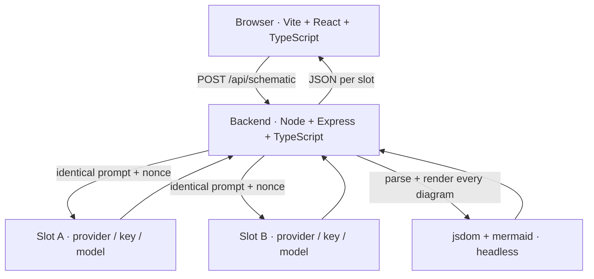

# Two models, one prompt, and the checklist that made it worth sharing

### How I built Schematic, and the five non-obvious problems that came out of it

---

Every model can draw you a system design. Ask for "a URL shortener at 10M clicks/day" and you get a
load balancer, an app tier, a cache, a database — in a tidy Mermaid flowchart that looks like it came
from a staff engineer.

The diagrams are plausible. That is exactly the problem.

Here is the thing nobody notices until they look: **one of those diagrams has no retries and no
observability.** Nothing on the canvas tells you that. The picture is confident, symmetric, and
complete-looking. You have to read every label to find out what is *missing*, and reading every label
is precisely the work you were trying to avoid.

So I built [Schematic](https://github.com/harishkotra/schematic): send the identical prompt to two
models, render both diagrams live, and then run a checklist against each one.

> Did this model remember a cache, a queue, auth, retries, observability, idempotency?

The output is two plausible architecture diagrams and a grid that proves, tick by tick, that one of
them forgot retries. The checklist is the payload. The diagrams are just the setup.

This post is about the engineering, and mostly about the parts that were harder than they looked.

---

## The shape of it



Three decisions shaped everything after them:

1. **Every model call goes through the backend.** Not for security theatre — because a local Ollama or
   LM Studio server has no CORS headers, and calling it from the browser simply does not work.
2. **Both slots get a byte-identical prompt.** Only the model varies, so any difference in output is
   the model's doing and nothing else.
3. **The server's verdict is the one that counts.** The browser renders for the human; the server
   parses for the truth. A client-side quirk can never turn a broken diagram into a `PARSED` badge.

The stack is deliberately boring: Vite + React + TypeScript on 5173, Express + TypeScript on 3001,
mermaid.js for rendering, jsdom for headless validation, plain `fetch` for model calls. No SDK, no
state manager, no ORM, no auth. About 5,100 lines including tests.

---

## Problem 1: "the same prompt" is harder than it sounds

The premise of the whole app is fairness. Both models must see the same bytes.

But there is a subtlety. If you send the *exact same* prompt on every run, a provider with prompt
caching can serve you a cached completion — and now you are not comparing models, you are comparing
cache hits. Worse, during development you can convince yourself a change fixed something when really
you just re-ran an identical request.

So every run appends a fresh random nonce:

```ts
export function buildUserPrompt(brief: string, nonce: string): string {
  return [
    `Design the architecture for ${brief}.`,
    '',
    'Output ONE Mermaid flowchart. Output only the Mermaid source in a ```mermaid fence. ' +
      'Label every component and every edge.',
    '',
    `(request nonce: ${nonce} — ignore this line)`,
  ].join('\n');
}
```

Both slots get the *same* nonce, so the prompts are still byte-identical to each other. The server
keeps a set of prompt hashes and reports `promptReused` plus a warning if one ever repeats. The e2e
check asserts a second run produces a different hash, and that stripping the nonce line makes the two
prompts identical again — which proves the nonce is the *only* difference.

**This turned out to matter more than I expected.** See the section on model reliability below: adding
that nonce line measurably changed what small models emitted. More on that later — it is the kind of
detail that quietly invalidates a benchmark.

---

## Problem 2: extracting Mermaid without "helping"

A model asked for a fenced Mermaid block will usually give you one. It will also sometimes give you
prose first, a fence without the language tag, or a bare diagram with no fence at all.

The tempting move is to clean it up: fix the fence, strip the prose, maybe correct an obvious syntax
slip. **Do not do this.** The moment you repair the output, you are no longer showing what the model
produced, and the entire product is a claim about what the model produced.

So extraction is layered, and it *records which layer fired*:

```ts
export type ExtractionPath = 'mermaid-fence' | 'plain-fence' | 'bare' | 'bare-inline' | 'none';
```

- `mermaid-fence` — a clean ` ```mermaid ` block. The good case.
- `plain-fence` — a fence whose first line is a diagram keyword.
- `bare` — the whole reply is the diagram.
- `bare-inline` — a keyword line found *mid-reply*. This is the weak one: the model wrote prose first,
  and the extraction is a best guess. Recording the path means the UI can say so.
- `none` — no diagram. Reported as `errorKind: "no-mermaid"`, not as an empty diagram.

Broken source is never repaired. It goes to the real parser, and the parser's exact words are shown.

---

## Problem 3: running Mermaid headlessly in Node

This was the hardest part, and it is the reason the app can make any claims at all.

I wanted the **real** Mermaid parser and the **real** renderer on the server, because the alternative —
a regex that looks for `-->` and calls it a diagram — would make every count and every error message a
lie. Mermaid is a browser library. Here is what it took.

### The `window` bridge, and one ordering trap

Mermaid reaches for `CSSStyleSheet`, `DOMParser`, `MutationObserver` and friends by bare name, so the
jsdom window has to be projected onto `globalThis`:

```ts
const dom = new JSDOM('<!DOCTYPE html><html><body></body></html>', { pretendToBeVisual: true });

for (const key of Object.getOwnPropertyNames(dom.window)) {
  if (SKIP.has(key)) continue;
  define(globalThis, key, (dom.window as never)[key]);
}
```

Two details that cost me real time:

**`navigator` is a getter-only global in modern Node.** A plain `globalThis.navigator = ...` throws.
Everything has to go through `Object.defineProperty`:

```ts
function define(target: object, key: string, value: unknown): void {
  try {
    Object.defineProperty(target, key, { value, writable: true, configurable: true });
  } catch {
    /* non-configurable global: leave Node's own binding in place */
  }
}
```

**The import order is load-bearing.** `dompurify` (a Mermaid dependency) captures `window` at
module-evaluation time. Import Mermaid at the top of the file and it grabs a `window` that does not
exist yet, and you get a failure that points nowhere near the cause. The import must happen *after* the
globals are installed:

```ts
// Boot the DOM, then import Mermaid. The import MUST come after the globals exist.
const mermaid = (await import('mermaid')).default;
```

### jsdom has no layout engine

Mermaid's dagre layout calls `getBBox()` and `getComputedTextLength()` while placing nodes. jsdom does
not implement them — it has no layout engine at all — so they throw. The fix is to stub them with fixed
metrics:

```ts
svgProto.getBBox = () => ({ x: 0, y: 0, width: 120, height: 24 });
svgProto.getComputedTextLength = () => 120;
```

This is safe precisely because **geometry is not what we are verifying.** We care whether the source
parses and whether the renderer completes. We are not measuring pixels.

### Mermaid keeps process-wide state, so serialize it

Mermaid renders through a shared temporary node and holds diagram state globally. Two concurrent
renders in one jsdom corrupt each other. But model calls must stay concurrent — that is the point of
the app.

The resolution is that validation is cheap next to a 60-second model call, so model calls stay parallel
and only validation is serialized behind a promise-chain mutex:

```ts
let chain: Promise<unknown> = Promise.resolve();

export function withMermaidLock<T>(fn: () => Promise<T>): Promise<T> {
  const run = chain.then(fn, fn);
  chain = run.then(() => undefined, () => undefined);
  return run;
}
```

### Two stages, because parsing is not drawing

A parse pass alone does not prove a diagram draws. So validation runs both stages against real Mermaid
and only reports ok when both succeed:

```ts
const diagram = await mermaidAPI.getDiagramFromText(source); // real jison parser + populated DB
graph = readGraph(diagram?.db);

// Stage 2: actually render. Do not claim success without rendering.
const out = await mermaid.render(renderId, source);
```

The `finally` block matters too: when `mermaid.render` throws it leaves its measuring node in the DOM,
and those accumulate. Cleanup is best-effort but necessary.

### Counting from the parsed diagram, not the string

This is where the counts become trustworthy. Mermaid's `FlowDB` holds `vertices` as a **`Map`** and
`edges` as an **`Array`**. Note the asymmetry — and note that `db.getVertices()` returns a *stale* `{}`,
so the accessor is a trap:

```ts
const nodes = normalizeCollection(vertices).map((v) => ({
  id: str(v.id),
  label: str(v.text ?? v.label ?? v.id),   // node label lives in `text`
}));

const edges = normalizeCollection(rawEdges).map((e) => ({
  start: str(e.start ?? e.from),
  end: str(e.end ?? e.to),
  label: str(e.text ?? e.label ?? ''),     // edge label lives in `text`
}));
```

Why this matters: a one-line `A --> B` reports **2 nodes / 1 edge**. A line-counting implementation
would report 1 node / 0 edges. When the whole product is a claim about what a model remembered, counts
have to come from the structure the parser built.

And when a diagram type has no vertex/edge accessor, the answer is `{ source: 'unavailable', note }` —
never a number derived from the raw string.

---

## Problem 4: making a tick auditable

The checklist is the product, so a tick has to be *checkable*. Each one reports the concept, the regex
term that fired, the literal matched label, and where it matched:

```
Cache     = "⚡ Redis Cache Cluster"        (node label, source line 10)
Queue     = "📨 Apache Kafka\n(Event Bus)"  (node label, source line 40)
Database  = "🗄️ Primary Database\n(...)"    (node label, source line 14)
```

The obvious verification is `source.includes(matchedLabel)`. **That check fails, and it fails for a
reason that has nothing to do with the model.**

Mermaid **rewrites label text while parsing**. A source containing `RC[(Read Cache<br/>Short → Long
URL)]` comes back from the parser with the label `Read Cache<br>Short → Long URL` — `<br/>` normalized
to `<br>`. So the parsed label is not a byte-for-byte substring of the source.

I had two options: weaken the claim to "the label is *similar* to something in the source", or keep the
claim strong and do the work. I kept it strong. The matched label is reported exactly as Mermaid read
it — the honest value — and the source line is located under the same normalization:

```ts
function normalizeForSearch(text: string): string {
  return text.replace(/<br\s*\/?>/gi, '<br>').replace(/&nbsp;/gi, ' ').replace(/\s+/g, ' ').trim();
}

export function findSourceLine(source: string, label: string): { line: number; text: string } | null {
  const target = normalizeForSearch(label);
  const lines = source.split('\n');
  for (let i = 0; i < lines.length; i++) {
    if (normalizeForSearch(lines[i]).includes(target)) return { line: i + 1, text: lines[i].trim() };
  }
  return null;
}
```

Now every tick carries `sourceLine` and `sourceText`, the UI prints them, and the e2e fails the run if
any tick cannot be resolved to a real label on a real source line. A tick is no longer an assertion —
it is a citation.

**The general lesson:** "is this string in that string" is a naive audit whenever a parser sits between
them. Normalize on both sides, or your verification will report failures that are artifacts of your own
comparison.

---

## Problem 5: capability detection, and never inventing a number

Different providers report different things. LM Studio reports
`usage.completion_tokens_details.reasoning_tokens` for reasoning-capable models; Ollama usually does
not. So the app detects rather than assumes:

```ts
const reasoningTokens = num(usage.completion_tokens_details?.reasoning_tokens);
return { reasoningTokens, reasoningSupported: reasoningTokens !== null };
```

Absent means `null`, which the UI renders as **n/a** — and it **hides the thinking toggle**, because
offering a control that does nothing is worse than not offering it. It never prints `0`. Zero reasoning
tokens and "this provider does not report reasoning tokens" are completely different facts.

The same principle applies to the thinking flag. `chat_template_kwargs: {"enable_thinking": false}` is
understood by Particle.ai for `deepseek-*` models. Every other provider either ignores unknown fields
or rejects them outright, so it is omitted entirely:

```ts
if (shouldSendThinkingFlag(config.provider, config.model, config.disableReasoning)) {
  body.chat_template_kwargs = { enable_thinking: false };
}
```

### Chain-of-thought is read only to be measured

Reasoning models return their thinking in `message.reasoning_content`. It must never be logged, stored,
displayed, or returned. The only thing that survives is its length:

```ts
const cot = message.reasoning_content ?? message.reasoning;
const reasoningCharsStripped = typeof cot === 'string' ? cot.length : 0;
return { content, reasoningCharsStripped };   // the text itself never leaves this function
```

A test asserts the serialized response contains no `reasoning_content` key at all, and the e2e greps
the full response for it.

### The trap: HTTP 200 with empty content is not a refusal

This one bit me early. A reasoning model with `max_tokens: 1600` can spend the *entire* budget on
hidden chain-of-thought and return `content: ""` with a perfectly happy HTTP 200. Naively, that looks
like the model refused or broke.

It is neither. It is a budget failure, and it is worth one retry with a doubled budget:

```
attempt #1  max_tokens=1600 → empty-content (1599 reasoning tokens)
attempt #2  max_tokens=3200 → empty-content (3199 reasoning tokens)
→ "This is a budget/behaviour failure, not a refusal."
```

Cap is 4000. And the message says what actually happened, with the real numbers, instead of
"Something went wrong".

### Two more numbers I refused to fake

- **`sha256`** is the hash of the Mermaid source. A slot with no source initially rendered
  `e3b0c442…` — the SHA-256 of the *empty string*, which looks exactly like a real fingerprint. It now
  reports **n/a**, and the reply's hash moved to its own `rawReplySha256` field so nothing is lost.
- **Truncation is flagged, not scored.** A reply cut off at the token ceiling can leave a handful of
  node declarations with no edges. Mermaid accepts it, the badge says `PARSED`, and the checklist
  dutifully reports every concept as missing — making a truncation look like a model that forgot
  everything. Reading `finish_reason` and marking the diagram `degenerate` fixes the diagnosis.

---

## Problem 6: LM Studio serves one request at a time

The spec says both slots run concurrently. Local providers must work. Those two requirements collide
on LM Studio, which serializes requests and answers a second simultaneous one with an **instant HTTP
500**:

```
concurrent, different models : 500 @ 0.0s   +  200 @ 7.5s
concurrent, same model twice : 500 @ 0.0s   +  200 @ 6.8s
sequential, different models : 200 @ 4.0s   +  200 @ 6.4s
```

Local comparisons were broken roughly half the time. The fix keys off the *pattern*, not a status code
— because the status code is not stable (I have since seen HTTP 400 for the same condition):

```ts
export function isLocalConcurrencyRefusal(result: ModelResult): boolean {
  if (result.errorKind !== 'http') return false;
  const status = result.attempts[0]?.httpStatus ?? null;
  if (status === null || status < 400 || status >= 600) return false;
  return result.provider === 'ollama' || result.provider === 'lmstudio' || isLocalBaseUrl(result.baseUrl);
}
```

When exactly one slot was refused while the other succeeded, that is the local server serializing, not a
bad request — so the refused slot is re-run on its own and the panel says so.

The important restraint: **a hosted provider's 5xx is not retried.** There, a 500 is a genuine upstream
failure and silently retrying it would hide a real problem. And if the local error was genuine, it
recurs on the retry and is reported verbatim. Nothing is masked in either direction.

---

## Problem 7: the share card, and why `htmlLabels: false` is load-bearing

The export needs a 1080×1080 PNG with both diagrams and the checklist. The approach: serialize the
already-rendered Mermaid SVG, load it into an `` as a data URL, and draw it to a canvas.

That silently produces **empty boxes** unless Mermaid runs with `htmlLabels: false`.

By default Mermaid renders node labels as `<foreignObject>` containing HTML. Browsers refuse to draw
`foreignObject` content when an SVG is rasterized through an `` — the rasterizer treats the SVG as
untrusted and drops it. Your exported PNG comes out with correctly-sized, completely empty nodes, and
nothing errors.

Setting `htmlLabels: false` makes labels plain `<text>`, which rasterizes fine. A pleasant side effect:
plain text opens cleanly in Figma, so the exported SVG is genuinely editable.

```ts
mermaid.initialize({
  startOnLoad: false,
  htmlLabels: false,      // required for the PNG share card, and better for Figma
  securityLevel: 'strict',
  theme: 'dark',
  themeVariables: { /* … */ },
});
```

---

## What the data actually showed

I probed every LM Studio model on my machine three times each, using the app's **exact** nonce-bearing
prompt, and pushed every reply through the real validator.

| Model | Mermaid parsed | Avg latency | Dominant failure |
| --- | --- | --- | --- |
| `google/gemma-4-12b` | **3 / 3** | 76 s | — |
| `ornith-1.0-35b` | **3 / 3** | 48 s | — |
| `openai/gpt-oss-20b` | 0 / 3 | 15 s | unquoted `(…)` in a label |
| `google/gemma-4-e4b` | 0 / 3 | 30 s | unquoted `(…)` in a label |
| `zai-org/glm-4.7-flash` | 0 / 3 | 51 s | empty content |
| `meta/muse-glimmer` | 0 / 3 | 107 s | parse error |
| `qwen/qwen3.5-9b` | 0 / 3 | 35 s | empty content — CoT ate the budget |
| `qwen/qwen3.8-27b` | 0 / 3 | 220 s | empty content |

**Five of eight local models could not produce a single valid Mermaid flowchart in three attempts.**

The dominant failure is one specific mistake. Mermaid requires parentheses in labels to be quoted:

```
CC[Click Counter (Kafka + Redis)]      ← rejected
CC["Click Counter (Kafka + Redis)"]    ← parses
```

I verified that directly rather than assuming, because a validator that is too strict would produce
exactly the same symptom. It is a real Mermaid rule: `[(...)]` is the cylinder shape, so the parser
starts reading a node shape and chokes on the parenthesis.

Two more failure modes worth naming:

1. **Empty content from reasoning models.** `qwen/qwen3.5-9b` spent every token on hidden CoT at both
   1600 and 3200 budgets and never emitted a content token.
2. **Truncation that still parses** — described above, and the reason `degenerate` exists.

### The finding that made me re-run every benchmark

`openai/gpt-oss-20b` parsed **3/3 without** the nonce line and **0/3 with** it.

The nonce is mandatory. Had I probed without it, I would have shipped a demo configuration that does
not work in the actual app — and I would have had a table of numbers "proving" it did.

**If you take one thing from this post:** probe with the *exact* prompt your app sends. A one-line
difference changed a model's parse rate from 100% to 0%.

### And a caveat about local runtimes

Reliability is load-dependent, not just model-dependent. A run where two large models were resident on
one LM Studio instance at the same time saw `gemma-4-12b` — which had just scored 3/3 in isolation —
burn 3,197 reasoning tokens and return nothing. Generation slows when the machine is loaded, and a
reasoning model can exhaust its budget before emitting a single content token.

The app handled it correctly (retried once, then reported a budget failure with real numbers and no CoT
leak), but it is a real constraint on recording a demo.

---

## The result

Two panels, each with node count, edge count, source bytes, latency, tokens, and a `PARSED` / `FAILED`
badge. A checklist with one row per concept and two ticks. On failure, the verbatim Mermaid error and
the offending line. A diff strip with the shareable one-liner:

> **B planned for retries and observability; A did not.**

Plus per-panel source editors so a broken diagram can be fixed live on camera, Download SVG, a
1080×1080 share card, and Copy results as JSON.

## What I would tell someone building this

1. **Never repair the model's output.** The moment you clean it up, you are reviewing your own work.
2. **Never print a number you cannot back.** `n/a` is a feature. The empty-string hash and the
   `0` reasoning tokens are the two places this almost went wrong.
3. **Validate with the real parser, not an approximation.** The jsdom work was the hardest 150 lines in
   the project and the only reason any claim here holds up.
4. **Make every claim cite its source.** A matched label plus a source line beats a score.
5. **Probe with your exact prompt.** A nonce line moved a model from 100% to 0%.
6. **Distinguish "the model failed" from "our pipeline failed."** Truncation, budget blowouts, and
   concurrency refusals all looked like model failures until they were diagnosed properly.

The uncomfortable, satisfying outcome: the app's thesis — that models produce confident, plausible
architecture diagrams with real gaps — turned out to be true of the models drawing the diagrams too.
Five of eight could not produce valid Mermaid at all. The tool caught that because it was built to show
failures rather than hide them.

---

Built by **[Harish Kotra](https://harishkotra.me)**. Checkout my other builds at
**[dailybuild.xyz](https://dailybuild.xyz)**.

Source, the verification evidence, and the full reliability measurements:
`README.md` and `VERIFICATION.md` in the repository.